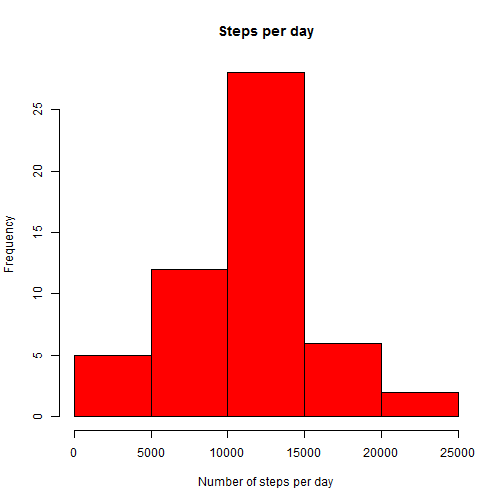
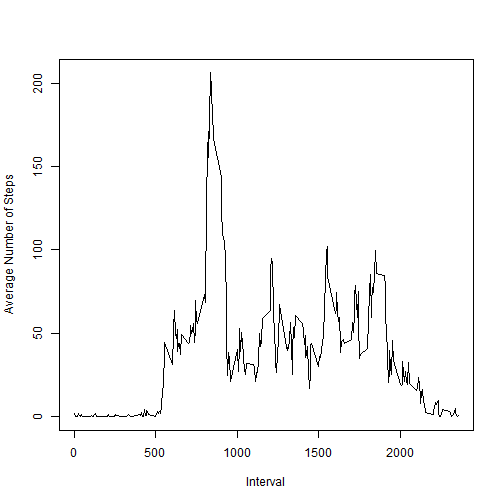
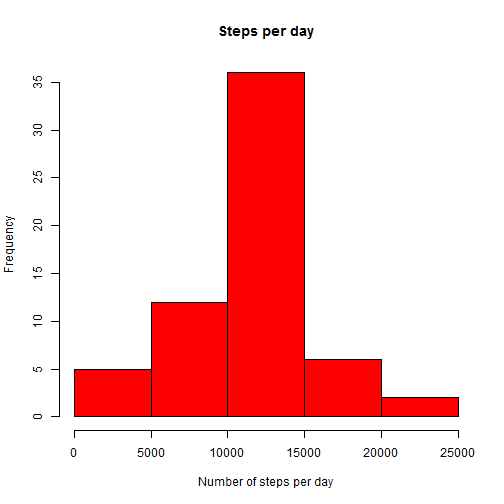
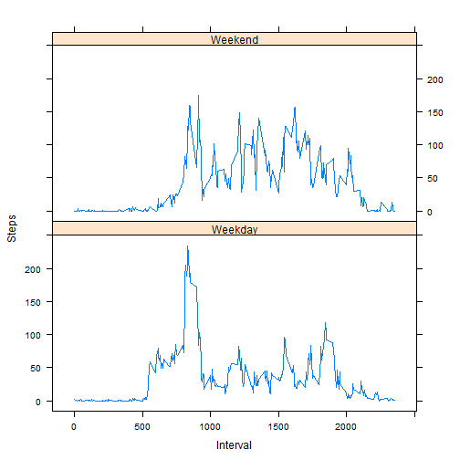

# Reproducible Research: Peer Assessment 1

## Loading and preprocessing the data

Unziping and loading the data:

```r
data <- read.csv(unzip("./activity.zip"))
head(data)
```

```
##   steps       date interval
## 1    NA 2012-10-01        0
## 2    NA 2012-10-01        5
## 3    NA 2012-10-01       10
## 4    NA 2012-10-01       15
## 5    NA 2012-10-01       20
## 6    NA 2012-10-01       25
```

## What is mean total number of steps taken per day?

Plotting a histogram showing total amount of steps per day:

```r
hist(tapply(data$steps, data$date, sum), main = "Steps per day", xlab = "Number of steps per day", col = "red")
```

 

```r
mean(tapply(data$steps, data$date, sum), na.rm = TRUE)
```

```
## [1] 10766
```

```r
median(tapply(data$steps, data$date, sum), na.rm = TRUE)
```

```
## [1] 10765
```

## What is the average daily activity pattern?

Plotting intervals vs average number of days:

```r
plot(unique(data$interval), tapply(data$steps, data$interval, mean, na.rm = TRUE), type = "l", xlab = "Interval", ylab = "Average Number of Steps")
```

 

```r
avgStepsPerInterval <- tapply(data$steps, data$interval, mean, na.rm = TRUE)
intervalMaxAverage <- as.numeric(names(avgStepsPerInterval[which(avgStepsPerInterval == max(avgStepsPerInterval), arr.ind = TRUE)])) # Some perversion, don't look here :D
# Although, any suggestions on how to get the interval number (which comes as a row.name after tapply()) here in a more elegant way are welcome in the comment section on Coursera :)
```

Interval with maximum number of steps is in 830-835 interval

## Imputing missing values


```r
sum(is.na(data))
```

```
## [1] 2304
```

```r
sum(is.na(data$steps))
```

```
## [1] 2304
```

Total number of missing values is 2304, all of which are in "Steps" column

For imputing missing values I will take the mean for corresponding 5-minutes interval taking into account whether this day was weekend or weekday. In my view this will give more accurate results. 

\\--> Later update: Taking an average number of steps per interval per day of the week could be more accurate in some cases, perhaps. But I've already implemented the first variant and I'm too lazy and want to go to bed :) Some day, maybe...

In order to do that I'll create a copy of original dataset and add a new column with factor variable indicatind whether it is weekday or weekend which will also be used in the next part of assignment.


```r
data2 <- cbind(data, as.factor(ifelse(weekdays(as.Date(data$date)) %in% c("Saturday", "Sunday"), "Weekend", "Weekday")))
names(data2) <- c("steps", "date", 'interval', 'weekday')
head(data2)
```

```
##   steps       date interval weekday
## 1    NA 2012-10-01        0 Weekday
## 2    NA 2012-10-01        5 Weekday
## 3    NA 2012-10-01       10 Weekday
## 4    NA 2012-10-01       15 Weekday
## 5    NA 2012-10-01       20 Weekday
## 6    NA 2012-10-01       25 Weekday
```

```r
str(data2)
```

```
## 'data.frame':	17568 obs. of  4 variables:
##  $ steps   : int  NA NA NA NA NA NA NA NA NA NA ...
##  $ date    : Factor w/ 61 levels "2012-10-01","2012-10-02",..: 1 1 1 1 1 1 1 1 1 1 ...
##  $ interval: int  0 5 10 15 20 25 30 35 40 45 ...
##  $ weekday : Factor w/ 2 levels "Weekday","Weekend": 1 1 1 1 1 1 1 1 1 1 ...
```

Also I'll create a dataset which will contain the means for each interval on weekdays and weekends separately:

```r
z <- aggregate(data2$steps ~ data2$interval + data2$weekday, data = data2, mean)
names(z) <- c("Interval", "Weekday", "Steps")
z$Weekday <- as.character(z$Weekday)
head(z)
```

```
##   Interval Weekday  Steps
## 1        0 Weekday 2.3333
## 2        5 Weekday 0.4615
## 3       10 Weekday 0.1795
## 4       15 Weekday 0.2051
## 5       20 Weekday 0.1026
## 6       25 Weekday 1.5128
```

```r
str(z)
```

```
## 'data.frame':	576 obs. of  3 variables:
##  $ Interval: int  0 5 10 15 20 25 30 35 40 45 ...
##  $ Weekday : chr  "Weekday" "Weekday" "Weekday" "Weekday" ...
##  $ Steps   : num  2.333 0.462 0.179 0.205 0.103 ...
```

Which will now be used for imputing missing values:

```r
for(i in 1:length(data2$steps)){
    if(is.na(data2[i, "steps"])){
        data2[i, "steps"] <- z[z$Interval == data2[i, "interval"] & z$Weekday == data2[i, "weekday"], "Steps"]
    }
}
```

Values for the missing values in "steps" column were successfully replaced with figures from z dataset (which contains average number of steps per interval per weekday(-end)). We can compare numbers from first six rows from both datasets (which should be equal, if everything went right):

```r
head(z)
```

```
##   Interval Weekday  Steps
## 1        0 Weekday 2.3333
## 2        5 Weekday 0.4615
## 3       10 Weekday 0.1795
## 4       15 Weekday 0.2051
## 5       20 Weekday 0.1026
## 6       25 Weekday 1.5128
```

```r
head(data2)
```

```
##    steps       date interval weekday
## 1 2.3333 2012-10-01        0 Weekday
## 2 0.4615 2012-10-01        5 Weekday
## 3 0.1795 2012-10-01       10 Weekday
## 4 0.2051 2012-10-01       15 Weekday
## 5 0.1026 2012-10-01       20 Weekday
## 6 1.5128 2012-10-01       25 Weekday
```

Plotting new histogram of total amount of steps per day with NA changed to averages per interval per weekday(-end)

```r
hist(tapply(data2$steps, data2$date, sum), main = "Steps per day", xlab = "Number of steps per day", col = "red")
```

 

```r
mean(tapply(data2$steps, data2$date, sum))
```

```
## [1] 10762
```

```r
median(tapply(data2$steps, data2$date, sum))
```

```
## [1] 10571
```

So mean and median for the new values had declined compared to mean and median from the dataset with NAs: 1.0762 &times; 10<sup>4</sup> vs 1.0766 &times; 10<sup>4</sup> and 1.0571 &times; 10<sup>4</sup> vs 10765 respectively. 

## Are there differences in activity patterns between weekdays and weekends?


```r
library(lattice)
xyplot(Steps ~ Interval|Weekday, data = z, layout = c(1, 2), type = "l")
```

 
